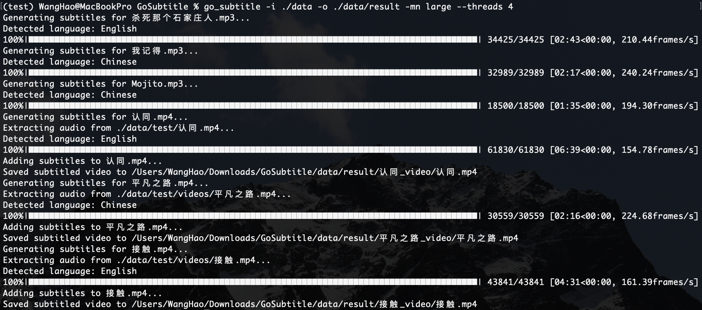

# Go Subtitle


## Quick start

***「go_subtitle」* 是一个从音频或视频中生成字幕的开源项目**

> ***「go_subtitle」 is an open source project that generates subtitles from audio or video***


### Setup

**项目需要运行在包含 *[python3.8.16](https://www.python.org/downloads/release/python-3816/)* 与 *[ffmpeg4.2.2](https://ffmpeg.org/download.html#releases)* 或更新版本的环境中**

> ***The project needs runs in an environment containing [python3.8.16](https://www.python.org/downloads/release/python-3816/) and [ffmpeg4.2.2](https://ffmpeg.org/download.html#releases) or later***

```shell
# 查看python版本
python --version

# 查看ffmpeg版本
ffmpeg -version
```


**你可以通过下面的命令安装最新的版本**

> ***You can install the latest version using the following command***

```shell
# 从PyPI安装
pip install -U go_subtitle

# 从GitHub安装
pip install git+https://github.com/RedHeartSecretMan/go_subtitle.git
```


## Usage

### Command Line

**提供两种命令行运行方式，通过指定 *python* 模块 *`python -m subtitler [command]`* 或触发关键字 *`go_subtitle [command]`***

> ***Provides two ways to run the command line, by specifying python module `python -m subtitler [command]` or trigger key `go_subtitle [command]`***

```shell
# 必须指定输入目录
python -m subtiter -i "input_dir"

# 可额外指定输出目录（所有路径都可以不使用引号）指定模型类型，指定cpu推理线程数
go_subtitle -i ./data -o ./data/result -mn large --threads 4 
```




**你可以命令行快速查看帮助**

> ***You can quickly view help on the command line***

```shell
go_subtitle -h
```


### Python

**提供了几种简单的使用方法，并且因为项目基于 *Whisper* 二次开发所以大多数 *API* 可以互相兼容**

```python
import torch
import subtitler


# 方式一
model = subtitler.load_model("small")
avpath = subtitler.get_avpath(["assets/data/test/audios"])
audio_path = subtitler.generate_subtitle(model, avpath)


# 方式二
# load medium model
model = subtitler.load_model("medium")

# load audio and pad/trim it to fit 30 seconds
audio = subtitler.load_audio("assets/data/test/audios/Mojito.mp3")
audio = subtitler.pad_or_trim(audio)

# make log-Mel spectrogram and move to the same device as the model
mel = subtitler.log_mel_spectrogram(audio).to(model.device)

# detect the spoken language
_, probs = model.detect_language(mel)
print(f"Detected language: {max(probs, key=probs.get)}")

# decode the audio
options = {}
options["fp16"] = True if torch.cuda.is_available() else False
options = subtitler.DecodingOptions(**options)

result = subtitler.decode(model, mel, options)

# print the recognized text
print(result.text)


# 方式三
# load large model
model = subtitler.load_model("large")

# gain audio stream, load audio and pad/trim it to fit 30 seconds
audio_path = subtitler.extract_audio("assets/data/test/videos/接触.mp4")
audio = subtitler.load_audio(audio_path)
audio = subtitler.pad_or_trim(audio)

# make log-Mel spectrogram and move to the same device as the model
mel = subtitler.log_mel_spectrogram(audio).to(model.device)

# detect the spoken language
_, probs = model.detect_language(mel)
print(f"Detected language: {max(probs, key=probs.get)}")

# decode the audio
options = {}
options["fp16"] = True if torch.cuda.is_available() else False
options = subtitler.DecodingOptions(**options)
result = subtitler.decode(model, mel, options)

# print the recognized text
print(result.text)
```


## Planning

**一、目前翻译功能的目标语言只支持英语，考虑支持中文**

**二、目前缺乏高级功能，后续考虑加入内容摘要功能以及类似沐神的视频自剪辑功能**


## Reference

[[Blog]](https://openai.com/blog/whisper)
[[Paper]](https://arxiv.org/abs/2212.04356)
[[Model card]](https://github.com/openai/whisper/blob/main/model-card.md)
[[Colab example]](https://colab.research.google.com/github/openai/whisper/blob/master/notebooks/LibriSpeech.ipynb)

***Whisper* 是一种通用的语音识别模型。它是在各种音频的大型数据集上训练的，也是一个多任务模型，可以执行多语言语音识别以及语音翻译和语言识别**

> ***Whisper is a general-purpose speech recognition model. It is trained on a large dataset of diverse audio and is also a multi-task model that can perform multilingual speech recognition as well as speech translation and language identification***


### Approach

**一个 *Transformer* 序列到序列模型训练各种语音处理任务，包括多语言语音识别、语音翻译、口语识别和语音活动检测。所有这些任务都被联合表示为由解码器预测的令牌序列，允许单个模型取代传统语音处理管道的许多不同阶段。多任务训练格式使用一组特殊的标记作为任务说明符或分类目标**

> ***A Transformer sequence-to-sequence model is trained on various speech processing tasks, including multilingual speech recognition, speech translation, spoken language identification, and voice activity detection. All of these tasks are jointly represented as a sequence of tokens to be predicted by the decoder, allowing for a single model to replace many different stages of a traditional speech processing pipeline. The multitask training format uses a set of special tokens that serve as task specifiers or classification targets***


### Available models and languages

**共有五种尺寸的多模态语言模型，模型尺寸越大准确性越高，速度也越慢。尺寸较小的四种语言模型，还有英文单模态版本，处理英文内容时只需使用 *`base.en`* 模型即可，即准确又快**

> ***There are a total of five sizes of multi-modal language models, the larger the size of the model, the higher the accuracy, the slower the speed. The smaller size of the four language models, as well as the English single-modal version, only need to use the `base.en` model when processing English content, that is accurate and fast***


|  Size  | Parameters | English-only model | Multilingual model | Required VRAM | Relative speed |
| :----: | :--------: | :----------------: | :----------------: | :-----------: | :------------: |
|  tiny  |    39 M    |     `tiny.en`      |       `tiny`       |     ~1 GB     |      ~32x      |
|  base  |    74 M    |     `base.en`      |       `base`       |     ~1 GB     |      ~16x      |
| small  |   244 M    |     `small.en`     |      `small`       |     ~2 GB     |      ~6x       |
| medium |   769 M    |    `medium.en`     |      `medium`      |     ~5 GB     |      ~2x       |
| large  |   1550 M   |        `\`         |      `large`       |    ~10 GB     |       1x       |


**`large` 模型有两个版本 *large-v1* 与 *large-v2*。下图显示了使用 *large-v2* 模型处理 *Fleurs* 数据集时按语言划分的单词错误率**

> ***The `large` model has two versions large-v1 and  large-v2. The figure below shows word error rates(WER) by language when using the large-v2 model for the Fleurs dataset***


